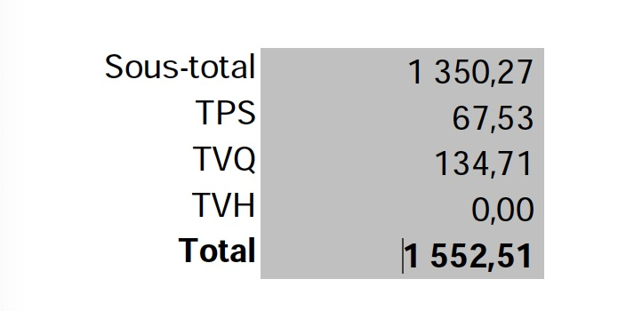

# pdfparse

I have a pdf file which has two fields "TPS", "TVQ", and I need to extract the value of these fields. This python script use pymupdf to extract these values.



# Usage

Install pymupdf
``` bash
$ python -m pip install --upgrade pymupdf
```
Then run this script:
```bash
$ python pdfparser.py xxxx.pdf
```
